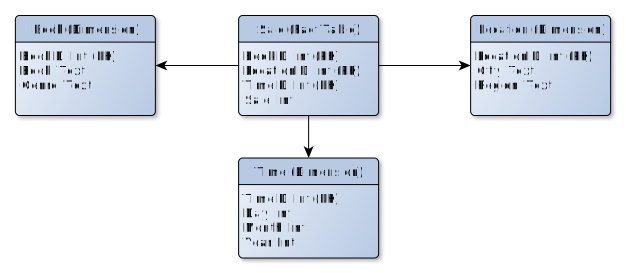

.. _beginner:

Beginner Guide
==============
The following is a small getting started guide, showcasing the various
constructs in *pygrametl* and how to utilise them in order to create a simple
ETL flow for a made-up example. The example used is shown in :ref:`dwexample`,
and is a small data warehouse represented as a star schema with three
dimensions. Firstly, a book dimension for storing the name and genre of a book
sold, then a location dimension with the city and state of the store, and lastly,
the time dimension with day, month and year of a sale. To keep the example
simple, none of dimension are snowflaked, nor do they contain any slowly changing
attributes. Both of these are however supported by pygrametl through
:class:`.SnowflakedDimension` and :class:`.SlowlyChangingDimension`. In
addition, pygrametl also contains support for creating high level
multiprocess or multithreaded ETL flow, depending on the implementation of Python used.
For more information about support for parallel ETL flows can be found
here: :ref:`parallel`.

.. note::
   When using pygrametl, we strongly encourage you to use named parameters
   when instantiating classes, in order to improve readability, and to prevent
   future errors in the event of changes to the API

.. _dwexample:

    
    Data Warehouse example

:Authors:
    | Christoffer Moesgaard <cmoesgaard@gmail.com> 
    | Søren Kejser Jensen <devel@kejserjensen.dk>

Input Data
----------
Most pygrametl abstractions either produce, consume or operate on data in
`rows`, where a row is a Python :class:`.dict` with the keys as "columns" and
the values being the data the row contains. For more information about each
available data source, refer to :ref:`datasources`.

We use data from a database relation containing sales records, in order to load
the data warehouse. The relation contains data as shown below.

.. code-block:: none

    book,                   genre,      store,      timestamp,  sale
    ----------------------------------------------------------------
    Nineteen Eighty-Four,   Novel,      Aalborg,    2005/08/05  50
    Calvin and Hobbes One,  Comic,      Aalborg,    2005/08/05  25
    The Silver Spoon,       Cockbook,   Aalborg,    2005/08/14  5
    The Silver Spoon,       Cockbook,   Odense,     2005/09/01  7
    ....

As the geographical information stored in the sales database about each store
is limited, the Location dimension is pre-filled by data from a file. The file
contains data as shown below with an extra tab added between each column for
readability.

.. code-block:: none

    city,       region
    Aalborg,    North Denmark Region
    Odense,     Region of Southern Denmark
    ....

ETL Flow
--------
The ETL flow is designed to run on CPython and use Postgresql as database
management system, but can easily be run on other implementations such as
Jython, by changing a few CPython specific components, such as the database
driver and :class:`.SQLSource`, as the C-based database drivers used by CPython
are incompatible with most other implementations. For more information about
running pygrametl on Jython see :ref:`jython`.

We start by importing the various functions and classes needed for the simple
ETL flow. Two parts of pygrametl need to be imported. The means to read
data from the sales database as well as from the CSV file is imported from the
module :mod:`.datasources`. Classes for interacting with the fact
table and the various dimensions are imported from :mod:`.tables`.

.. code-block:: python

    # psycopg2 is a database driver allowing CPython to access Postgresql
    import psycopg2

    # Pygrametl's __init__ file provides a set of helper functions and more
    # importantly the class ConnectionWrapper for wrapping PEP 249 connections
    import pygrametl

    # Pygrametl provides simple reading of data through datasources.
    from pygrametl.datasources import SQLSource, CSVSource

    # Interacting with the dimensions and the fact table is done through a set
    # of classes. A suitable object must be created for each.
    from pygrametl.tables import Dimension, FactTable

Before much can be done, a connection to both the database containing the sales
data, as well as a connection to actual data warehouses is needed. As we use
CPython, we use a PEP 249 connection for this. As the data warehouse connection
must be shared by multiple different pygrametl abstractions in the ETL flow, we
create an instance of :class:`.ConnectionWrapper`, as the first instance of
this class is set as the default connection for pygrametl's abstractions,
allowing it to be used without having to pass it directly to each abstraction
that needs it. This is not needed for the connection to the sales database as
it is only needed by one abstraction, so in that case we just use the PEP 249
connection directly. For more information about database connections in
pygrametl see :ref:`database`.

.. code-block:: python

    # Creation of a database connection to the sales database with a simple
    # connection string, specifying the necessary host, username and passowrd
    sales_string = "host='10.0.0.12' dbname='sale' user='user' password='pass'"
    sales_pgconn = psycopg2.connect(sales_string)

    # A connection is also created for the data warehouse. The connection is
    # then given to a ConnectionWrapper for it to implicitly shared between
    # all the pygrametl abstractions that needs it with being passed around
    dw_string = "host='10.0.0.13' dbname='dw' user='dwuser' password='dwpass'"
    dw_pgconn = psycopg2.connect(dw_string)

    # Although the ConnectionWrapper is shared automatically between pygrametl
    # abstractions, we still save in in a variable to allow for it to be closed
    dw_conn_wrapper = pygrametl.ConnectionWrapper(connection=dw_pgconn)

To get data into the ETL flow, two data sources are created. One for the
database containing the sales data, and one for the CSV file containing the
region information. For more information about the various data sources see
:ref:`datasources`. 

.. code-block:: python
    
    # As the location dimension stores the name of a location in the attribute 
    # "city" instead of in the attribute "store" as in the input data from the 
    # sales relation, a sequence of names matching the number of attributes in 
    # the relation is created, allowing the SQLSource to do the mapping for us
    name_mapping= 'book', 'genre', 'city', 'timestamp', 'sale'
   
    # Extraction of rows from a database using a PEP 249 connection and SQL
    sales_source = SQLSource(connection=sales_pgconn, \
                             query="SELECT * FROM sales", names=name_mapping)

    # Extraction of rows from a CSV file does not require SQL, just an open file
    # handle to the file, as pygrametl uses Pythons DictReader for CSV files, 
    # and the header of the CSV file contains information about each column.
    region_file_handle = open('region.csv', 'r', 16384)
    region_source = CSVSource(csvfile=region_file_handle, delimiter=',')                                                                                                                                  

An object must then be created for each dimension in the data warehouse, as
well as an object for the fact table. Pygrametl contains multiple different
types of dimension and fact table object abstractions. In this example we use
the simplest ones. For more information about the more advanced dimension and
fact table objects, see :ref:`dimensions` and :ref:`facttables`.

.. code-block:: python

    # An instance of Dimension is created for each dimension in the data
    # warehouse. For each table, the name of the table, the primary key of
    # the table, and a list of non key attributes in the table, are added. 
    # In addition, for the location dimension we specify which attributes 
    # should be used for a lookup of the primary key, as only the city is 
    # present in the sales database and is enough to perform a lookup of 
    # a unique primary key. As mentioned in the beginning of the guide, using
    # named parameters is strongly encouraged.

    book_dimension = Dimension(
        name='book',
        key='bookid',
        attributes=['book', 'genre'])

    time_dimension = Dimension(
        name='time',
        key='timeid',
        attributes=['day', 'month', 'year'])

    location_dimension = Dimension(
        name='location',
        key='locationid',
        attributes=['city', 'region'],
        lookupatts=['city'])

    # A single instance of FactTable is created for the data warehouse's
    # fact table, with the name of the table, a list of attributes constituting
    # the primary key of the fact table, and lastly, the list of measures.
    fact_table = FactTable(
        name='facttable',
        keyrefs=['bookid', 'locationid', 'timeid'],
        measures=['sale'])

As the input timestamp is a string, and the time dimension consists of multiple
levels, day, month, and year, the string must be split into its separate
values. For this, we simply create a normal Python function and pass it each of
the rows. As pygrametl is a Python library, the manipulation of data be written
in standard Python without any syntactic additions or restrictions.

.. code-block:: python

    # A normal Python function is used to split the timestamp into its parts
    def split_timestamp(row):
        """Splits a timestamp containing a date into its three parts"""
       
        # First the timestamp is extracted from the row dictionary
        timestamp = row['timestamp']

        # Then the string is split on the / in the time stamp
        timestamp_split = timestamp.split('/')

        # Finally each part is reassigned to the row dictionary. It can then be
        # accessed by the caller as the row is a reference to the dict object
        row['year'] = timestamp_split[0]
        row['month'] = timestamp_split[1]
        row['day'] = timestamp_split[2]

Finally, the data can be inserted into the data warehouse. All rows from the
CSV files are inserted into the location dimension as the file contains all the
data needed, and the data needs to exist in the dimension in order for a
foreign key to be computed for the fact table. The other two dimensions are
built during the insertion of facts, as the needed data is included in the
sales data from the database. To ensure that the data is committed to the
database, the method :meth:`.ConnectionWrapper.commit` is called, before
:meth:`.ConnectionWrapper.close` which closes the connection to the database.

.. code-block:: python
    
    # The Location dimension is filled with data from the CSV file, as the file 
    # contains information for both columns in the table. If the dimension was 
    # filled using the sales database, it would be necessary to update the 
    # region attribute with data from the CSV file later irregardless.
    # To perform the insertion, the method Dimension.insert() is used which 
    # inserts a row into the table, and the connection wrapper is asked to 
    # commit to ensure that the data is present in the database to allow for 
    # lookups of keys for the fact table
    [location_dimension.insert(row) for row in region_source]

    # The file handle for the CSV file can then be closed
    region_file_handle.close()

    # As all the information needed for the other dimensions are stored in the
    # sales database, we can loop through all the rows in it, split the timestamp
    # into its three parts, and lookup the three dimension keys needed for
    # the fact table while letting pygrametl update each dimension with the
    # necessary data using Dimension.ensure(). Using this method instead of
    # insert combines a lookup with a insertion so a new row only is inserted
    # into the dimension or fact table, if it does not yet exist.
    for row in sales_source:
        
        # The timestamp is split into its three parts
        split_timestamp(row)

        # We update the row with the primary keys of each dimension while at
        # the same time inserting new data into each dimension
        row['bookid'] = book_dimension.ensure(row)
        row['timeid'] = time_dimension.ensure(row)

        # We do not use ensure() for the location dimension, as city
        # and region information of all stores has already been loaded into
        # the table, and having a sale from a store we do not know about is
        # probably either an error in the sales or region data. We use lookup
        # instead which does not insert data and returns None, if no row with
        # the requested data is available, allowing for simple implementation 
        # of error handling in ETL flow, which is shown here as an exception
        row['locationid'] = location_dimension.lookup(row)

        # A simple example of how to check if a lookup was successful, so
        # errors can be handled in some way. Here we just give up, and throw
        # an error.
        if not row['locationid']:
           raise ValueError("City was not present in the location dimension")

        # As the number of sales was already conveniently aggregated in the
        # sales table, the row can now be inserted into the data warehouse as
        # we have all the IDs we need. If aggregations, or other more advanced
        # manipulation is required, the full power Python is available as shown 
        # with the call to the split_timestamp(row) function.
        fact_table.insert(row) 

    # After all the data is inserted, we close the connection in order to 
    # ensure that all data is committed to the database and that the 
    # connection is correctly released
    dw_conn_wrapper.commit()
    dw_conn_wrapper.close()

    # Finally, the connection to the sales database is closed
    sales_pgconn.close()

These small examples show how to quickly create a very simple ETL flow with
pygrametl. A combined, less commented version, can be seen below, but as this
is only a very small example, the caching or bulk loading built into some of
the more advanced dimension and fact table classes has not been used. In
anything but very small ETL flows, these should however be used. See
:ref:`dimensions` and :ref:`facttables` for more information. Pygrametl also
provides a set of simple abstractions for performing operations in parallel on
multi-core systems, in order to increase the throughput of a ETL program. For
more information about parallelism, see :ref:`parallel`.

.. code-block:: python

    import psycopg2
    import pygrametl
    from pygrametl.datasources import SQLSource, CSVSource
    from pygrametl.tables import Dimension, FactTable

    # Opening of connections and creation of a ConnectionWrapper
    sales_string = "host='10.0.0.12' dbname='sale' user='user' password='pass'"
    sales_pgconn = psycopg2.connect(sales_string)

    dw_string = "host='10.0.0.13' dbname='dw' user='dwuser' password='dwpass'"
    dw_pgconn = psycopg2.connect(dw_string)
    dw_conn_wrapper = pygrametl.ConnectionWrapper(connection=dw_pgconn)

    # Creation of data sources for the sales database and the CSV file,
    # containing extra information about cities and regions in Denmark.
    name_mapping= 'book', 'genre', 'city', 'timestamp', 'sale'
    sales_source = SQLSource(connection=sales_pgconn, \
                             query="SELECT * FROM sales", names=name_mapping)

    region_file_handle = open('region.csv', 'r', 16384)
    region_source = CSVSource(csvfile=region_file_handle, delimiter=',')                                                                                                                                  
    # Creation of dimension and fact table abstractions for use in the ETL flow
    book_dimension = Dimension(
        name='book',
        key='bookid',
        attributes=['book', 'genre'])

    time_dimension = Dimension(
        name='time',
        key='timeid',
        attributes=['day', 'month', 'year'])

    location_dimension = Dimension(
        name='location',
        key='locationid',
        attributes=['city', 'region'],
        lookupatts=['city'])

    fact_table = FactTable(
        name='facttable',
        keyrefs=['bookid', 'locationid', 'timeid'],
        measures=['sale'])

    # Python function needed to split the timestamp into its three parts
    def split_timestamp(row):
        """Splits a timestamp containing a date into its three parts"""
      
        # Splitting of the timestamp into parts 
        timestamp = row['timestamp']
        timestamp_split = timestamp.split('/')
       
        # Assignment of each part to the dictionary 
        row['year'] = timestamp_split[0]
        row['month'] = timestamp_split[1]
        row['day'] = timestamp_split[2]

    # The location dimension is loaded from the CSV file, and in order for 
    # the data to be present in the database, the shared connection is asked 
    # to commit
    [location_dimension.insert(row) for row in region_source]
    
    # The file handle for the CSV file can then be closed
    region_file_handle.close()
    
    # Each row in the sales database is iterated through and inserted 
    for row in sales_source:
       
        # Each row is passed to the timestamp split function for splitting
        split_timestamp(row)

        # Lookups are performed to find the key in each dimension for the fact
        # and if the data is not there, it is inserted from the sales row
        row['bookid'] = book_dimension.ensure(row)
        row['timeid'] = time_dimension.ensure(row)

        # For the location dimension, all the data is already present, so a
        # missing row must be an error
        row['locationid'] = location_dimension.lookup(row)
        if not row['locationid']:
           raise ValueError("city was not present in the location dimension")

        # The row can then be inserted into the fact table
        fact_table.insert(row) 

    # The data warehouse connection is then ordered to commit and close
    dw_conn_wrapper.commit()
    dw_conn_wrapper.close()

    # Finally the connection to the sales database is closed
    sales_pgconn.close()
